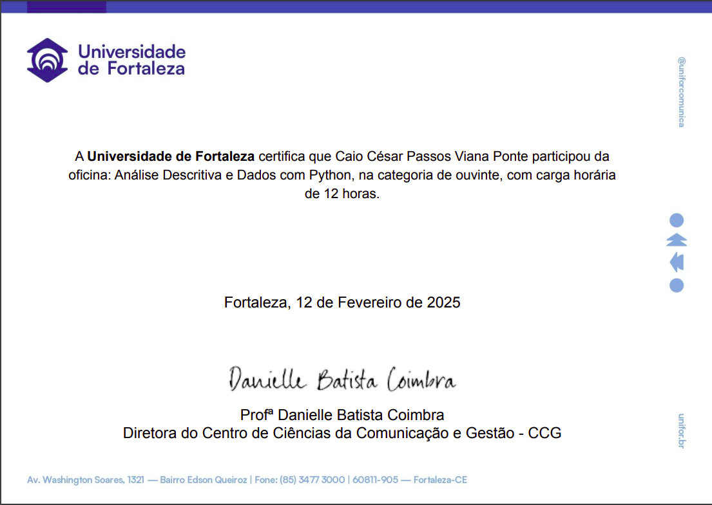

# 📊 Análise Descritiva com Python

Este repositório reúne as anotações, exercícios e aprendizados adquiridos na oficina de férias **"Análise Descritiva e Dados com Python"**, realizada pela **Universidade de Fortaleza (UNIFOR)** em fevereiro de 2025, sob orientação do professor **Júlio Peixoto**.

---

## 🎯 O que aprendi

Durante a oficina, explorei conceitos fundamentais da análise descritiva de dados utilizando Python, com foco prático em:

- Criação de dicionário de dados para documentação e organização das variáveis;
- Geração e interpretação de estatísticas descritivas (gerais e por grupo);
- Exportação de resultados para `.csv` para facilitar o compartilhamento e análise externa;
- Uso da biblioteca `Sweetviz` para criar relatórios automatizados e visuais;
- Seleção dos tipos de gráficos mais adequados para cada tipo de informação.

Além disso, trabalhei com bases de dados desconhecidas, o que foi essencial para desenvolver a habilidade de explorar, transformar e interpretar dados antes de extrair insights.

---

## 🗂️ Arquivos incluídos

- `Exercícios_oficina_de_férias_Análise_Descritiva_com_Python.ipynb`  
  Notebook com os exercícios e aplicações práticas.

- `certificado.png`  
  Certificado de participação emitido pela Universidade de Fortaleza.

---

## 🔗 Acesse o notebook no Google Colab

Você pode explorar todo o conteúdo interativo aqui:  
👉 [Google Colab - Análise Descritiva com Python](https://colab.research.google.com/drive/1qYuSamTm_EMqVmoi83qQrXkuyY4IU8ce?usp=sharing#scrollTo=5LaSFhWqN-jg)

---

## 🏅 Certificado

---

## 🛠️ Tecnologias utilizadas

- Python 3.x
- Jupyter Notebook
- Pandas
- Matplotlib
- Seaborn
- Sweetviz

---

## 👨‍🎓 Sobre mim

Sou estudante de Ciências Econômicas com foco em dados aplicados à economia, políticas públicas e finanças. Essa oficina foi parte do meu desenvolvimento prático no uso de ferramentas quantitativas voltadas para a realidade dos dados.

---

## 🔗 Conecte-se comigo

- [LinkedIn](https://www.linkedin.com/in/caio-cesar-ponte-economist/)
- [GitHub](https://github.com/CaioCesarEconomist)

---

## 📌 Tags

`#Python` `#AnáliseDeDados` `#CiênciaDeDados` `#Estatística` `#UNIFOR` `#Sweetviz` `#OficinaDeFérias`
